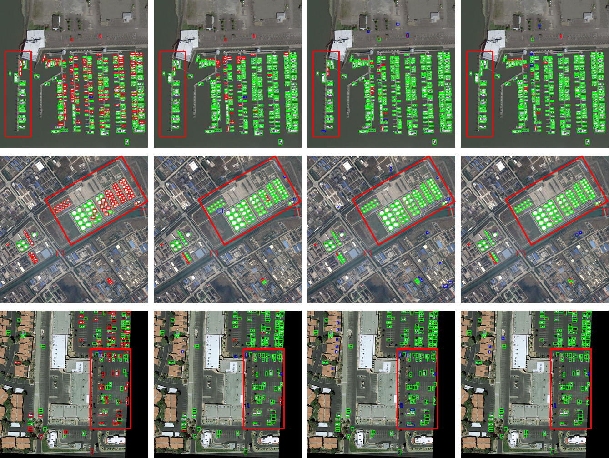

# <p align=center> Tiny Object Detection in Remote Sensing Images Based on Object Reconstruction and Multiple Receptive Field Adaptive Feature Enhancement    (IEEE TGRS 2024) </p>

This repository contains python implementation of our paper [ORFENet](https://ieeexplore.ieee.org/document/10462223).

### 1. Required environments:
* Linux
* Python 3.6+
* PyTorch 1.3+
* CUDA 9.2+
* GCC 5+
* [MMCV](https://mmcv.readthedocs.io/en/latest/#installation)
* [cocoapi-aitod](https://github.com/jwwangchn/cocoapi-aitod)


### 2. Install and start ORFENet:

Note that our ORFENet is based on the [MMDetection 2.24.1](https://github.com/open-mmlab/mmdetection). Assume that your environment has satisfied the above requirements, please follow the following steps for installation.

```shell script
git clone https://github.com/dyl96/ORFENet.git
cd ORFENet
pip install -r requirements/build.txt
python setup.py develop
```
### Prepare Dataset:
Download [AI-TODv2](https://drive.google.com/drive/folders/1Er14atDO1cBraBD4DSFODZV1x7NHO_PY?usp=sharing) dataset; Download [LEVIR-Ship](https://github.com/WindVChen/LEVIR-Ship) dataset.

### Train and test：
##### Train aitodv2 dataset:
```
python tools/train.py configs_orfenet/orfenet/aitodv2_fcos_r50_p2_hrfe_or_3x.py
```
##### Train LEVIR-Ship dataset:
```
python tools/train.py configs_orfenet/orfenet/levir_ship_fcos_r50_p2_hrfe_or_1x.py
```
##### Test LEVIR-Ship dataset:
```
python tools/test.py configs_orfenet/orfenet/levir_ship_fcos_r50_p2_hrfe_or_1x.py work_dirs/levir_ship_fcos_r50_p2_hrfe_or_1x/epoch_12.pth --eval bbox
```
#### Checkpoint Download：
Baidu Pan：https://pan.baidu.com/s/1eyJiSV12hX6gggiuq8-DFA?pwd=uon2 
code：uon2 


### 3. Visual Results
<p align="center">
     <br />
</p>
Visual comparisons of the proposed method and other methods. (a) the baseline FCOS. (b) FSANet. (c) Cascade-R-CNN w/ NWD-RKA. (d) The proposed ORFENet. The green boxes denote the true positive predictions, the red boxes denote the false negative predictions, and the blue boxes denote the false positive predictions.

### 4. Citation

Please cite our paper if you find the work useful:

    @ARTICLE{10462223,
          author={Liu, Dongyang and Zhang, Junping and Qi, Yunxiao and Wu, Yinhu and Zhang, Ye},
          journal={IEEE Transactions on Geoscience and Remote Sensing}, 
          title={Tiny Object Detection in Remote Sensing Images Based on Object Reconstruction and Multiple Receptive Field Adaptive Feature Enhancement}, 
          year={2024},
          volume={62},
          number={},
          pages={1-13},
          doi={10.1109/TGRS.2024.3381774}}

